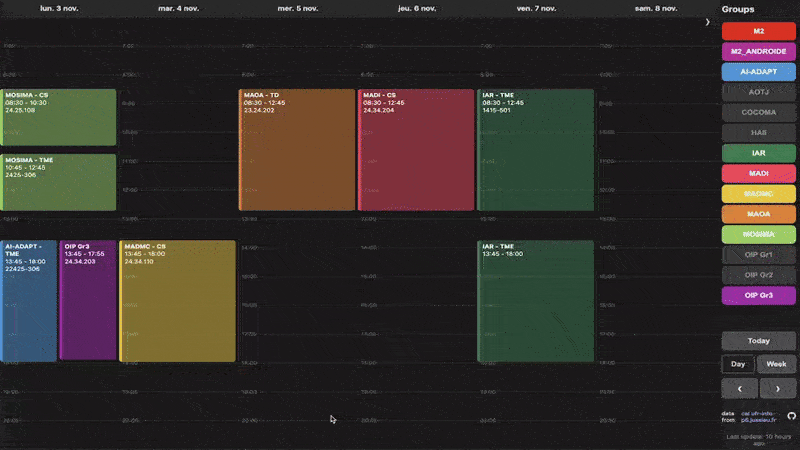

# Sorbonne Calendar Viewer (AI2D)

[Website Link](https://sorbcal.github.io/ai2d)

This project was created to provide students with a faster, more responsive, and mobile-friendly alternative to the official university web calendar. The original calendar, while functional, can be slow to load and difficult to navigate on a phone, especially with limited connectivity. This viewer solves that by efficiently pre-processing the public calendar data and displaying it in a clean, dark-mode interface.

The official calendar, which is the source of all data displayed here, can be found at: **[cal.ufr-info-p6.jussieu.fr](https://cal.ufr-info-p6.jussieu.fr/master/)**

> A quick demo showing the interface and group filtering.
>
> 

## Features

*   **Instantaneous loading:** The viewer loads in under a second on a typical mobile connection (50ms on Wi-Fi with fetch), compared to several seconds for the original calendar. The calendar is separated into near future and far future.
*   **Automated Scraping:** A script navigates the calendar data and extracts events for multiple groups.
*   **Mobile-First Dark Mode UI:** A clean, responsive interface designed for phone screens, with both daily and weekly views.
*   **Dynamic Group Filtering:** Users can toggle which groups they want to see, with their preferences automatically saved in their browser for future visits.
*   **Multi-Day Navigation:** Users can navigate through the calendar using buttons, keyboard arrow keys, or by swiping on a touch device.
*   **Data Freshness Alerts:** The interface monitors the age of the scraped data and visually alerts the user with a popup if it becomes stale, suggesting they check the original source.

## Performance: Why a Decoupled Viewer?

By separating the data collection from the fast data presentation, this viewer significantly improves performance and **reduces the load on the university's servers**. Instead of every user loading the entire heavy calendar application, they download a lightweight static page that fetches only the pre-processed event data.

This results in:
*   **Faster Load Times:** Near-instantaneous loads versus several seconds for the original application.
*   **Reduced Data Transfer:** Megabytes of assets for the original page versus just kilobytes of JSON data for this viewer.
*   **Fewer Server Requests:** A single data request versus dozens of requests for scripts, styles, and images on the original site.

> The following chart illustrates the difference in initial page load resources between the original calendar and this viewer, on a fast connection. The data is compressed efficiently, resulting in only around 7KB of json.

## Changelog
*   **2025-10-20:**
    - Removed 'outdated' popup when data becomes recent enough

*   **2025-10-13:**
    - Fixed a bug where group numbers would not show.
    - Added support for DEEP-L (MIND/DAC) and RDFIA (IMA) classes.
    - Added ER1 and ER2 event types.
    - Reset default view mode (daily/weekly) to load weekly by default on wide screens.
    - Fixed overlap issues for event details and sidebar by hiding the sidebar or event when appropriate.
    - Increased sidebar toggle button size

# Known issues
*   Weekly view may require two clicks/swipes to go to the next week on sundays. No fix planned yet.

## How It Works

This project uses a decoupled architecture to separate data collection from data presentation.

### 1. The Scraper (local)
This is a script that runs locally to scrape only the necessary calendar data, cleans it and uploads it to a public Gist, which acts as a free, simple JSON API. The script is expected to be run periodically only during critical hours to ensure the data is fresh. Since we don't scrape the calendar website directly, it's faster and more efficient.
*   **Technology:** Python

### 2. The Frontend Viewer (`index.html`, `style.css`, `script.js`)

This is a completely static web application hosted for free on GitHub Pages. It has no backend server of its own. It fetches the pre-processed calendar data from the public Gist and displays it in a user-friendly interface.
*   **Technology:** HTML, CSS, Vanilla JavaScript.

## Feedback and Cooperation

This is an independent project created for the benefit of the student community.

*   **Feedback & Requests:** Have a feature request, found a bug, or have any other feedback? Please **[open an issue](https://github.com/sorbcal/ai2d/issues)** on this repository. All feedback is welcome.
*   **Cooperation:** This project relies on publicly available data. If you are an official representative of the university and have any concerns, questions, or wish for this site to be taken down, please open an issue or contact me directly.

## Project Roadmap

### Achieved Goals
- [x] Core scraping logic, efficient by not going to the website directly.
- [x] Data persistence via API (GitHub Gist).
- [x] Clean, mobile-friendly dark mode user interface.
- [x] Daily and Weekly views.
- [x] Client-side preference storage for group filters.
- [x] Dynamic timeline view with intelligent overlap management.
- [x] Multi-day navigation (buttons, keyboard, swipe).
- [x] "Last updated" timestamp and stale data alerts.
- [x] Live "current time" indicator.

### Future Goals (that I might never implement)
- [ ] **Optimized Fetching:** Separate different calendars for less data to send. (cons: more requests)
- [ ] **User-Selectable Themes:** Add a toggle for a light mode theme.

## Keyboard Shortcuts

The calendar viewer supports the following keyboard shortcuts for easy navigation:

### Navigation
- **← (Left Arrow)** - Go to previous day/week
- **→ (Right Arrow)** - Go to next day/week
- **Space** - Go to today's date

### View Controls
- **D** - Switch to day view
- **W** - Switch to week view

### Sidebar
- **Tab** - Toggle sidebar visibility

### Touch Controls
- **Swipe Left** - Go to next day/week
- **Swipe Right** - Go to previous day/week

### Event Interaction
- **Click/Tap** on any event to view detailed information
- **ESC** - Close event detail popup or instruction popup

## License
This project is open source and available under the [MIT License](LICENSE).